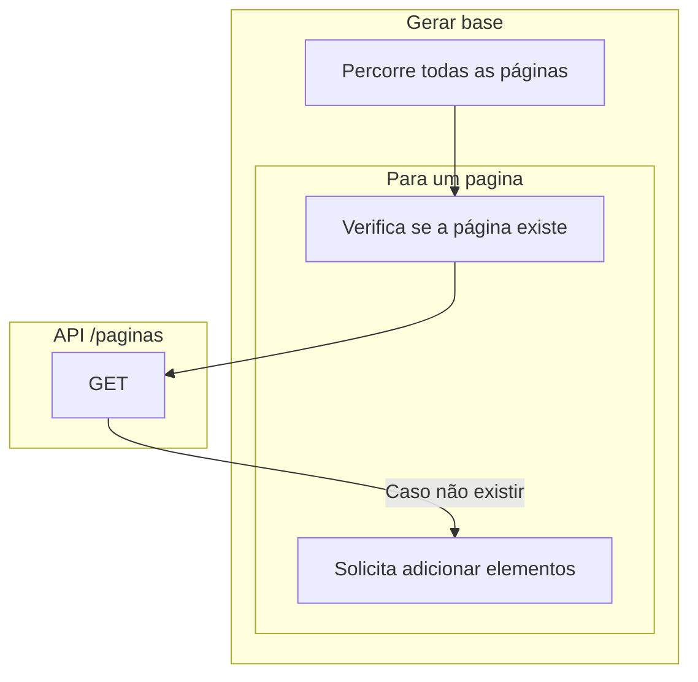

# Gerar base

Esse repositório tem como objetivo gerar uma base de dados de manchetes.

A base que vai ser construída utilizará os dados das páginas baixadas. Para realizar essa tarefa primeiro os dados serão extraídos via python3, depois será consultado a API GET /paginas para verificar se uma determinada página foi adicionada, caso não for vai ser adicionada.

Ao final do processo é esperado ter uma base de dados com todas as informações das manchetes.

